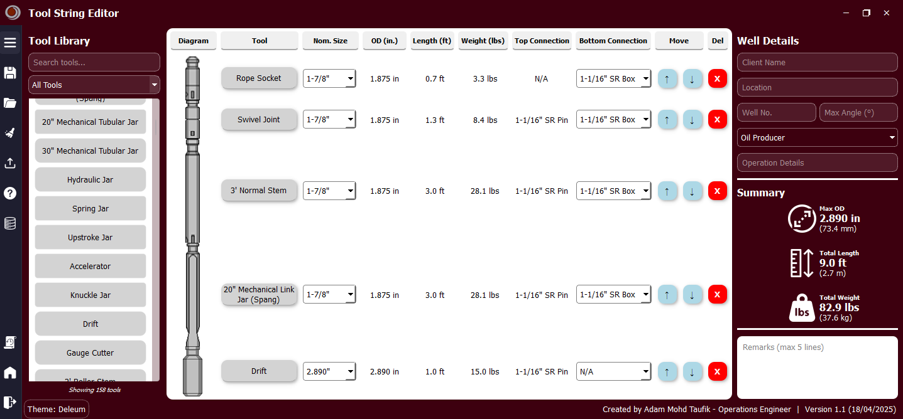

# 🛠️ Deleum Tool String Creator

Deleum Tool String Creator is a Python-based application designed to create and manage tool string configurations for wireline interventions. The software allows engineers to drag and drop tools, export tool strings to Excel/PDF, and maintain a database of available tools.

## 🚀 Features
- **Drag & Drop Tool String Builder**
- **Tool Database Management**
- **Save & Load Configurations**
- **Export to Excel & PDF**
- **Intuitive UI with Modern Design**

## 🏗️ Installation
### 🔹 **Requirements**
- Python 3.10+
- Required dependencies (see `requirements.txt`)

### 🔹 **Setup**
1. Clone this repository:
   ```sh
   git clone https://github.com/adamtaufik/ToolStringCreator.git
   cd ToolStringCreator
   ```
2. Install dependencies:
   ```sh
   pip install pandas openpyxl pyqt6 pyqt6-qt6 pyqt6-tools pillow pywin32
   ```
3. Run the application:
   ```sh
   python main.py
   ```

## 📸 Screenshots
<!-- Add screenshots of the UI here -->



## 📝 Changelog
See [`CHANGELOG.md`](CHANGELOG.md) for version history.

## 🤝 Contributing
See [`CONTRIBUTING.md`](CONTRIBUTING.md) for guidelines.

## 💡 Authors
- **Adam Mohd Taufik** – *Lead Developer & Wireline Operations Engineer*

## 🔗 Contact
For questions, reach out via Adam.MohdTaufik@deleum.com or create an issue on GitHub.
